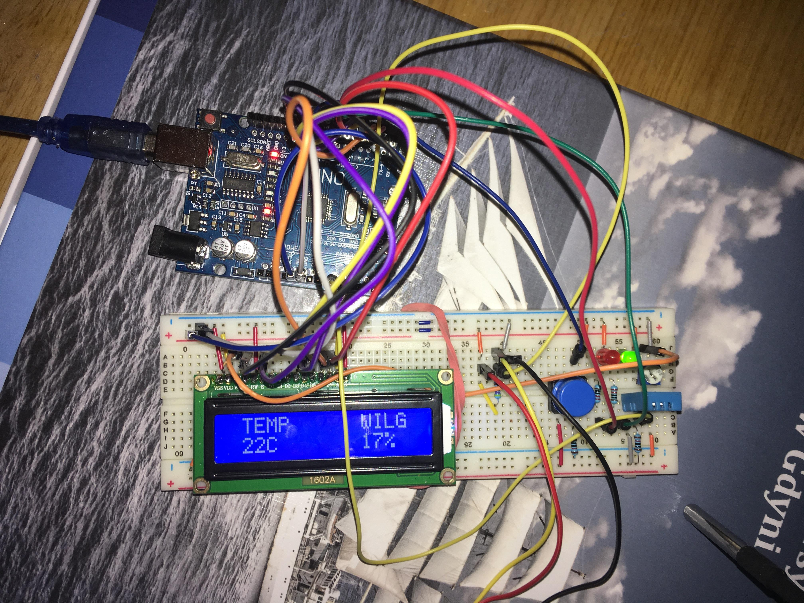

# Weather station on Arduino Uno platform displaying temperature and humidity

## General description

Components used:

* Arduino Uno R3
* Prototype board 830 fields.
* LCD display 2x16
* Goldpin connector 1x16 2.54mm.
* 10kΩ potentiometer.
* DHT11 module
* DS18B20 module
* Tact-Switch button.
* 21 jumpers of various lengths
* 16 male-to-male wires of various lengths.
* 2 220Ω resistors used for the LEDs.
* 10kΩ resistor used for the button.
* 4.7kΩ resistor used for DS18B20 sensor.
* 4.7kΩ resistor used for DHT11 sensor.

The circuit displays on the LCD screen the temperature in Celsius and Fahrenheit taken from the DS18B20 sensor and the humidity taken from the DHT11 sensor.
The button used allows you to select whether you want to display the temperature in Celsius or Fahrenheit signaling the corresponding LED (Green for C, Red for F).

## Code Description
The following libraries were used.
```cpp
#include <OneWire.h>                             // Library used for correct operation of DS18B20 temperature sensor
#include <DallasTemperature.h>                   // Library used for DS18B20 temperature sensor
#include <LiquidCrystal.h>                       // Library used for LCD screen
#include <Adafruit_Sensor.h>                     // Library used for the correct operation of the DHT11 sensor
#include <DHT.h>                                 // Library used for the DHT11 sensor
```
Next, variables and PINs were declared for each component.
```cpp
#define DHT_PIN A0                                // Digital PIN connected to DHT11
#define DHTTYPE DHT11                             // Defined DHT type (in this case DHT11)
const int SENSOR_PIN = A1;                        // Digital pin connected to DS18B20
const int buttonPin = 9;                          // PIN connected to the button
const int rledPin =  8;                           // PIN connected to red LED
const int gledPin =  7;                           // PIN connected to green LED
int buttonState = 0;
int klik = 0;
int button = 0;
bool CF = true;
DHT dht = DHT(DHT_PIN ,DHTTYPE);
LiquidCrystal lcd(12, 11, 5, 4, 3, 2);            // Connected LCD display PINS
OneWire oneWire(SENSOR_PIN);                      // Starts the oneWire library
DallasTemperature sensors(&oneWire);              // Transfers data from the oneWire to the DallasTemperature
```
In this part of the code, the two sensors are activated, the display is started, the text on the display is written out, and a button is declared as input while two LEDs are declared as output.
```cpp
void setup()
{
  pinMode(rledPin, OUTPUT);                       // Setting red LED as output
  pinMode(gledPin, OUTPUT);                       // Setting green LED as output
  pinMode(buttonPin, INPUT_PULLUP);
  lcd.begin(16, 2);
  lcd.print(" TEMP      WILG");                   // Displays the caption
  Serial.begin(9600);
  sensors.begin();                                // Activates DS18B20 sensor
  dht.begin();                                    // Activates DHT11 sensor
}
```
Variables were then assigned for temperature and humidity values.
```cpp
void loop()
{
  float tempC;                                    // Temperatura w C
  float tempF;                                    // Temperature w F
  float humidity = dht.readHumidity(DHT_PIN);     // Wilgotnosc
```
In this part, the program checks whether the DHT11 sensor is working properly.
If it returns an error the program informs us in the Serial Monitor.
If it works correctly, the program moves on.
```cpp
  if (isnan(humidity))                            // Checks for reading error from DHT11 sensor
    {
      Serial.println(F("No readout from DHT!"));   // Returns an error in Serial Monitor
      return;                                     // Loops until the error stops
    }
```
  The program reads the state of the button (high or low) and displays 1 or 0 in the Serial Monitor, respectively.
```cpp
  buttonState = digitalRead(buttonPin);           // Reading the status of the button (HIGH or LOW)
  
  Serial.print("  -  ");                          // Separator
  Serial.print("Button state:  ");              // Displays the caption
  Serial.println(buttonState);                    // Prints the status of the button in Serial Monitor
```
The state of the button is stored in a variable, then the temperature and LED are displayed depending on the state of the button.
In this part, the code is implemented for Celsius values.
```cpp
  button = buttonState;                           // Button state in variable
  if(klik==0 && button==1)
  {
  CF = !CF;
  }
  klik = button;
  
  if (CF)                                        // Choice between C or F
    {

      digitalWrite(gledPin, HIGH);               // Lights up a green LED
      digitalWrite(rledPin, LOW);                // Turns off red LED
      
      sensors.requestTemperatures();             // Sends command to read temperature value
      tempC = sensors.getTempCByIndex(0);        // Reads the temperature value in C

      Serial.print("Temp: ");                    // Displays text
      Serial.print(tempC);                       // Prints the temperature in C
      Serial.print("°C");                        // Displays text
      Serial.print("  -  ");                     // Separator
      Serial.print("Hum: ");                     // Displays text
      Serial.print(humidity);                    // Prints the humidity in %
      Serial.print("%");                         // Displays text
  
      lcd.setCursor(1,3);                        
      lcd.print(round(tempC));                   // Prints the temperature in C
      lcd.print("C       ");                     // Displays text
      lcd.print(round(humidity));                // Prints the humidity in %
      lcd.print("%   ");                         // Displays text
    }
 ```
 Here it displays values in Fahrenheit.
 The red LED lights up.
 ```cpp
  else
    {   
      digitalWrite(gledPin, LOW);                // Turns off green LED
      digitalWrite(rledPin, HIGH);               // Lights up a red LED
      
      sensors.requestTemperatures();             // Sends command to read temperature value
      tempC = sensors.getTempCByIndex(0);        // Reads the temperature value in C
      tempF = tempC * 9 / 5 + 32;                // Converts temperature value from C to F

      Serial.print("Temp: ");                    // Displays text
      Serial.print(tempF);                       // Prints the temperature in F
      Serial.println("°F");                      // Displays text
      Serial.print("  -  ");                     // Separator
      Serial.print("Hum: ");                     // Displays text
      Serial.print(humidity);                    // Prints the humidity in %
      Serial.print("%");                         // Displays text
  
      lcd.setCursor(1,3);                        
      lcd.print(round(tempF));                   // Prints the temperature in F
      lcd.print("F       ");                     // Displays text
      lcd.print(round(humidity));                // Prints the humidity in %
      lcd.print("%   ");                         // Displays text
   }
}
```
## A photo of the board and a video showing how the program works.



The operation of the button is illustrated in the video.

https://youtu.be/bysFPIYge0k
